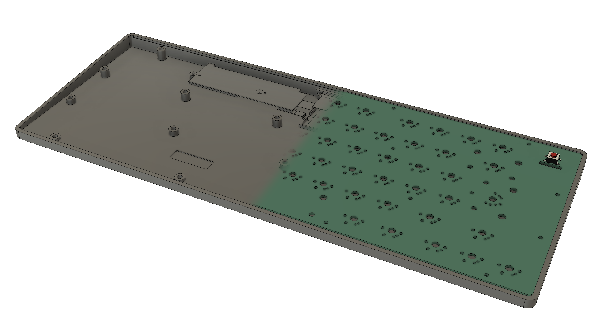

# The Hephaestus Mod

## ⚠️ DISCLAIMER ⚠️
Magic Keyboard is a trademark of Apple Inc.\
Apple Magic Keyboard is a trademark of Apple Inc.\
Touch ID is a trademark of Apple Inc.\
This project is not affiliated with Apple Inc. in any way.

The Hephaestus Mod is an independent project created by hardware enthusiasts. It is not endorsed, sponsored, ore supported by Apple Inc. Use this project at your own risk. Modifying your Magic Keyboard WILL void any warranty provided by Apple Inc.

## Introduction
The Hephaestus Mod is an open-source hardware modification for the Apple Magic Keyboard. This project aims create a mechanical keyboard using the Apple Magic Keyboard as a base.

## Getting Started
The Hephaestus Mod project is organized into the following directories:
- `ECAD-files/` - Contains the KiCad project files for the Hephaestus Mod.
    In this directory, you will find the following subdirectories:
    - `dev-board/` - Contains the KiCad project files for the development board. This board was used to test out if the reverse engineered keyboard matrix was correct.
    It can also be repurposed as a breakout board for the matrix connector. \
    **Be careful!** The revision 1.0 of the board contains errors for the 9, TAB and Option Right keys. I will make another revision of the dev board when I have time.
    - `prod-board/` - Contains the KiCad project files for the production board. This board is the version of the Hephaestus Mod that is intended to be used. \
    **Be careful!** For the moment this board is still not tested. It is still in manufacturing. I will update this README when I have tested it and confirmed that it works.
    - `touch-id-ribbon` - Contains the KiCad project files for the Touch ID ribbon cable. This cable is used to connect the Touch ID connector on the Apple motherboard to the production board.
- `MCAD-files/` - Contains the .STEP files of the Hephaestus Mod.
    - `hephaestus-case.step` - The case for the Hephaestus Mod.
    - `hephaestus-main-board.step` - The 3D model of the production board.
    - `magic-keyboard-battery.step` - The 3D model of the Magic Keyboard battery.
    - `magic-keyboard-motherboard.step` - The 3D model of the Magic Keyboard motherboard.

## Presumed Keyboard Matrices
You can check the presumed keyboard matrices below :
- [AZERTY Keyboard Matrix](./matrices/AZERTY.md)

## Build Instructions
🚧 **This section will be updated with instructions on how to get started with the Hephaestus Mod when the project is considered done.** 🚧

## License
This project is licensed under the CERN-OHL-S. See the [LICENSE](LICENSE) file for details.

## Contributing
We welcome contributions! Please read our [contributing guidelines](CONTRIBUTING.md) for more information on how to get involved.

## Contact
For questions, issues, or suggestions, please open an issue on our [GitHub repository](https://github.com/limentic/the-hephaestus-mod).

